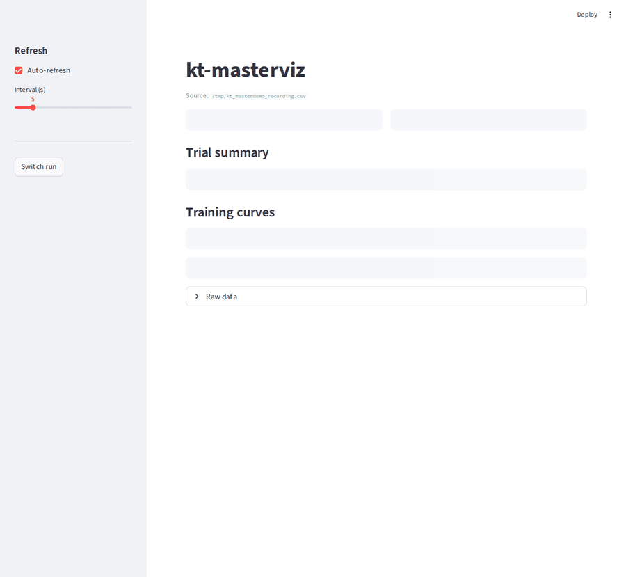

# kt-masterdemo

End-to-end demo of [kt-masterlog](https://github.com/techspeque/kt-masterlog) and [kt-masterviz](https://github.com/techspeque/kt-masterviz) working together — **installed from PyPI**, not from source. This repo's whole point is to validate that the published artifacts work and to give a try-before-you-buy walkthrough for the workflow.



## What you get

- A small **workflow demo** that runs a 3-trial × 15-epoch Bayesian sweep over a synthetic classification dataset — about 30–60 seconds on CPU.
- A live Streamlit dashboard that auto-discovers the run via the registry and updates as trials complete.
- A 10-second synthetic smoke test that runs in CI daily to catch breakage from upstream dependency upgrades or yanked releases.

The dataset is intentionally abstract (`sklearn.datasets.make_classification`). This repo demonstrates *how kt-masterlog and kt-masterviz fit together*, not how to model any specific problem.

## Quick start

```bash
git clone https://github.com/techspeque/kt-masterdemo.git
cd kt-masterdemo
uv sync
```

That pulls `kt-masterlog` and `kt-masterviz` from PyPI into a project-local `.venv/`.

### Run the demo

**Terminal 1** — start the tuner:

```bash
bash scripts/run.sh
# or directly:
uv run python examples/sweep_demo.py
```

**Terminal 2** — open the dashboard against the live run:

```bash
uv run kt-masterviz --latest
```

Open <http://localhost:8501>. The dashboard:

- Shows the trial summary sorted by `val_accuracy` (the configured objective)
- Plots training curves per trial, switchable across `loss`, `val_loss`, `accuracy`, `val_accuracy`
- Auto-refreshes every 5 s (configurable in the sidebar) so new trials show up live

When the tuner finishes, you'll see all 3 trials in the table and curves. The "Switch run" button in the sidebar lets you flip to other runs you've executed previously.

### Other entry points

```bash
uv run kt-masterviz --list                  # tabular listing of every registered run
uv run kt-masterviz                          # in-dashboard picker over all registered runs
uv run kt-masterviz /path/to/master_log.csv  # explicit CSV path (skip the registry)
```

## What the demo tunes

`examples/sweep_demo.py` builds a small MLP and exposes five hyperparameters:

| Hyperparameter | Values | Why |
|----------------|--------|-----|
| `units_1` | 32, 64, 128 | First hidden layer width |
| `units_2` | 16, 32, 64 | Second hidden layer width |
| `dropout` | 0.0 – 0.4 step 0.1 | Regularization sweep |
| `lr` | 1e-2, 1e-3, 3e-4 | Learning rate; meaningful across both optimizers |
| `optimizer` | `adam`, `sgd` | Two qualitatively different optimizers; shows categorical tuning |

The data comes from `sklearn.datasets.make_classification` with a fixed `random_state`, so reruns are deterministic. The model deliberately stays simple — its job is to produce interesting-looking training curves so the dashboard has something to render, not to demonstrate a recommended architecture.

## What this repo is *not*

- **Not a published package.** `pyproject.toml` declares it but it has no build backend; uv just uses it for dependency management.
- **Not a fork** of either kt-masterlog or kt-masterviz. The published artifacts come straight from PyPI; this repo never imports source.
- **Not a model recommendation.** The hyperparameter ranges and architecture in `sweep_demo.py` are illustrative. Tune your own models with your own ranges.
- **Not a test suite** for either package. Each upstream repo has its own. This is a *consumer-side* smoke check.

## CI: daily PyPI smoke test

`.github/workflows/smoke.yml` runs `examples/synthetic_smoke.py` four ways:

- On every push to `main`
- On every PR
- Daily at 08:00 UTC via cron
- Manually from the Actions tab

The smoke test:

1. Installs `kt-masterlog` + `kt-masterviz` from PyPI via `uv sync`
2. Runs a 2-trial / 1-epoch synthetic search through `optimize()`
3. Verifies the master CSV was written
4. Verifies the registry manifest was created and marked `completed`
5. Verifies `kt-masterviz --list` finds the run

The cron run is the most valuable trigger — it catches the case where a transitive dependency change breaks the installed packages even though the kt-masterlog/kt-masterviz code hasn't changed.

## Requirements

- Python 3.12
- `uv` (auto-installs Python and deps)

No external dataset download — everything is generated on the fly.

## Regenerating the demo GIF

The GIF embedded above is committed to the repo. If the kt-masterviz UI
changes meaningfully and the recording goes stale, regenerate it:

```bash
bash scripts/record_demo.sh
```

This script (~25 s end-to-end):

1. Installs the dev group (`playwright`, `pillow`) into the venv
2. Installs Chromium for headless capture
3. Spawns the dashboard against a synthetic CSV
4. Writes realistic trial rows to that CSV on a 0.4 s schedule in the background
5. Captures 22 s of dashboard frames at 4 fps via Playwright
6. Stitches frames into `assets/demo.gif` via Pillow

Output is deterministic — same trial values every time — so diffs in
the committed GIF reflect real UI changes rather than ML stochasticity.

## License

MIT.
